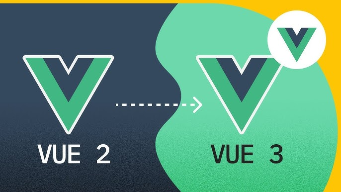
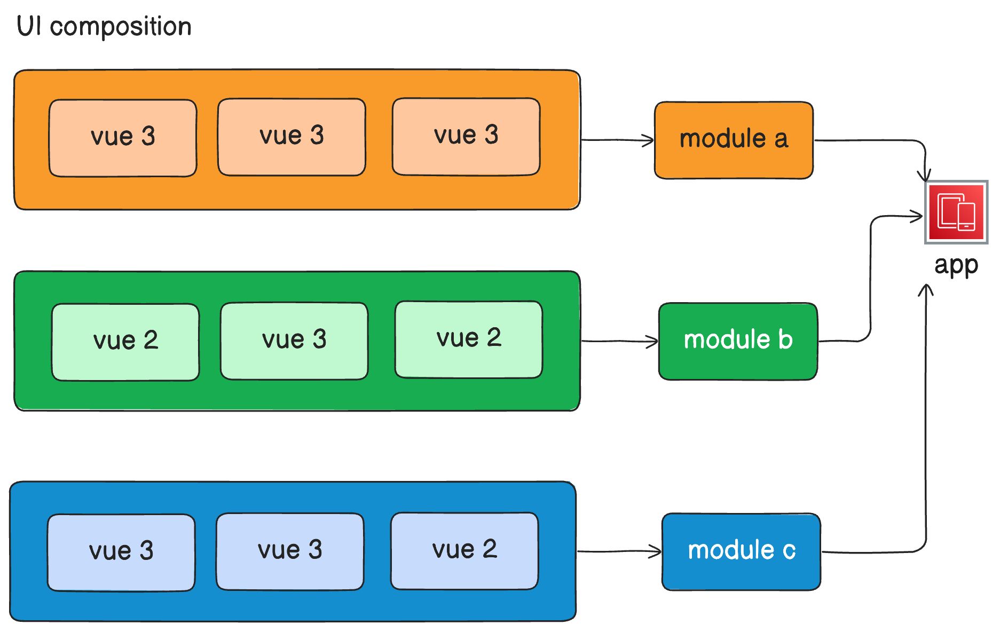

# 🚀 Mastering Microfrontends: Coexisting Vue 2 and Vue 3 in Large-Scale Applications 🚀



## 📚 Table of Contents
- [Introduction](#Introduction)
- [How it works](#How-it-works)
- [How createApp Bridges Vue 2 and Vue 3](#How-createApp-Bridges-Vue-2-and-Vue-3)
- [Understanding the `createApp` Function](#Understanding-the-createApp-Function)
- [Code Breakdown](#Code-Breakdown)
- [Using createApp in our sub-applications](#Using-createApp-in-our-sub-applications)
- [Vue 2 Component Setup](#Vue-2-Component-Setup)
- [Setup the bundler](#Setup-the-bundler)
- [Microfrontend alternatives](#Microfrontend-alternatives)
- [Benefits](#Benefits)
- [Wrapping up](#Wrapping-up)

## Introduction

Managing and evolving a large-scale application can be daunting, especially when it's built on an older framework version like Vue 2. Our application, originally built entirely in Vue 2, had grown in complexity, and as the need for new features and optimizations arose, we faced a tough decision: how to modernize without completely rewriting the codebase. Transitioning to Vue 3 was the obvious choice due to its powerful Composition API, better reactivity system, and improved performance. However, integrating Vue 3 into an existing, mature Vue 2 application presented significant technical challenges and architectural barriers.

Instead of embarking on a massive refactor or rewrite, we opted for a more innovative solution—a **microfrontend** approach 🌟. By treating the new Vue 3 components as separate modules, we could build and integrate new features like the Dashboard and Listings using Vue 3 while preserving the existing Vue 2 codebase, such as the Edit Payment Settings Modal. This hybrid setup allowed us to synchronize state, routes, and data seamlessly between the two frameworks.

In this blog post, we'll walk you through how we achieved this integration. We'll explore the code that connects and synchronizes Vue 2 and Vue 3, enabling you to modernize your application one component at a time while minimizing disruption and ensuring compatibility. Whether you're dealing with a legacy application or looking for a flexible upgrade path, this guide will help you navigate the complexities of combining different versions of Vue in a microfrontend architecture 🛠️.


## How it works

To illustrate the architecture of our hybrid application and the interactions between Vue 2 and Vue 3, we have two diagrams: one representing the overall flow and the other showcasing the module relationships.




The image above illustrates the progressive migration of modules within the application. It shows how each module can be built using either Vue 2 or Vue 3, allowing for flexibility in development. For example, a module might be entirely constructed with Vue 3, showcasing its full capabilities and new features, while another module could contain a mix of Vue 2 and Vue 3 components, leveraging existing legacy code alongside newly developed features.

This architecture supports a smooth migration path, promoting component reusability and scalability. By allowing both versions to work together, we can modernize the application incrementally, minimizing disruption while ensuring compatibility and performance improvements.

Next, we'll dive deeper into the createApp function, exploring how it acts as a bridge between Vue 2 and Vue 3, and the essential features it provides for a successful migration.

##  How createApp Bridges Vue 2 and Vue 3

The key to integrating Vue 2 and Vue 3 in our project lies in the createApp function. This function acts as a bridge that synchronizes the two frameworks, allowing them to share state and route handling smoothly. Let’s break down the code to better understand how this is achieved.

```ts
import { createPinia } from "pinia";
import { createApp as createVueApp, reactive } from "vue";

export const createApp = ({ app }) => {
  return ({ name = "#pagelet", context = {} }) => {
    const appInstance = createVueApp(app);
    const route = reactive({});
    const state = reactive({});

    // provide global access to Vue 2 from Vue 3
    appInstance.provide("route", route);
    appInstance.provide("vuex", { ...context.$store, state });

    appInstance.mount(name);

    // Synchronize Vue 2 route and state with Vue 3
    context.$watch("$route", (val) => Object.assign(route, val), { deep: true });
    context.$watch("$store.state", (val) => Object.assign(state, val), { deep: true });
  };
};
```

## Understanding the `createApp` Function

The `createApp` function is designed to facilitate the integration of Vue 3 applications within a Vue 2 environment. It is structured with an outer function and an inner function, each serving distinct purposes.

**Outer Function: createApp**
The outer function takes a single argument, an object that contains the app property. This app represents the configuration or component of the Vue 3 application that you want to render.

The primary purpose of this outer function is to establish a customizable and reusable entry point for creating Vue 3 applications. By accepting app as a parameter, it provides flexibility in specifying which Vue 3 component or configuration will be used during the rendering process.

**Inner Function: The Returned Function**
The createApp function returns another function, which contains the core logic for initializing the Vue 3 application. This inner function accepts an object with two parameters: name and context.
* `name:` This parameter has a default value of #pagelet. It specifies the DOM element, identified by a CSS selector, where the Vue 3 application will be mounted. By providing a default value, the function ensures that if the caller does not specify a mounting point, the application will render in a predefined location, enhancing usability.
* `context:` This parameter defaults to an empty object. It is intended to pass context from the Vue 2 application to the Vue 3 components. The context may include vital information, such as state management instances, routing details, or any other relevant data that Vue 3 components need to interact effectively with the existing Vue 2 infrastructure.

## Code Breakdown

**1. Creating the Vue 3 context (createVueApp):** The createVueApp function is responsible for initializing the Vue 3 application. This is the Vue 3 equivalent of the new Vue() function in Vue 2. By calling it, we generate an application instance that’s completely independent from Vue 2 but will be connected later.

```ts
const appInstance = createVueApp(app);
```

**2. Reactive variables to synchronize data:** Here, we declare two reactive objects, route and state, which allow us to keep the state and routes synchronized between Vue 2 and Vue 3. These reactive objects will automatically reflect changes in both frameworks 🔄.

```ts
const route = reactive({});
const state = reactive({});
```


**3. Injecting dependencies from Vue 3 into Vue 2:** Vue 3’s provide API allows us to inject dependencies globally into a component hierarchy. In this case, we’re injecting the route state and Vuex state from Vue 2 into Vue 3, enabling both frameworks to share the global application state.

```ts
appInstance.provide("route", route);
appInstance.provide("vuex", { ...context.$store, state });
```

* `route:` This is where we sync the routes between Vue 2 and Vue 3.
* `vuex:` Here, we inject the Vuex state from Vue 2 into Vue 3, allowing both frameworks to share the global store.


**4. Mounting Vue 3 inside a Vue 2 container:** By calling mount, the Vue 3 application is rendered inside a DOM element defined by name, which could be a div in the Vue 2 HTML. This allows Vue 3 to render its components within the DOM managed by Vue 2.

```ts
appInstance.mount(name);
```


**5. Synchronizing routes and state between Vue 2 and Vue 3:** To keep routes and state always in sync, we use Vue 2 watchers that listen for changes in $route and $store.state. Whenever there’s a change in Vue 2, we update the route and state objects in Vue 3 using Object.assign, ensuring that changes in one framework are reflected in the other.
```ts
context.$watch("$route", (val) => {
  Object.assign(route, val)
}, { deep: true });

context.$watch("$store.state", (val) => {
  Object.assign(state, val)
}, 
{ deep: true });
```

* `$route:` Watches for route changes in Vue 2 and updates the reactive route object in Vue 3.
* `$store.state:` Synchronizes Vuex state between Vue 2 and Vue 3.


## Using createApp in our sub-applications

In our architecture, sub-applications are empowered by their own instance of the createApp function. This approach allows us to maintain a consistent structure across different modules while leveraging the flexibility of Vue 3. By using createApp, we can seamlessly integrate various components into our existing infrastructure.

Here’s an example of how the payment settings module initializes its own Vue 3 application using our custom createApp function:
```ts
// payment-settings/src/app.ts
import { createApp } from "@org/core";

export const renderApp = createApp({
  app: import(() => "./app.vue"),
});
```

The entry point is designed to facilitate the seamless integration of new Vue 3 components into our existing Vue 2 application. By defining a clear entry point, we manage how and when these components are rendered, ensuring a smooth transition and enhanced functionality.

This modular architecture enables us to isolate and manage new features independently, simplifying development and improving maintainability across the codebase. With a structured entry point, we ensure that both Vue 2 and Vue 3 components coexist harmoniously, offering a robust foundation for future growth while minimizing the complexity of integration.

Inside the `app.vue` we use the Vue 3 application to access a Vue 2 modal component and manage form updates within the new tech stack. This approach not only maintains compatibility between Vue 2 and Vue 3 but also ensures that any changes in the user context are reflected immediately. Our integration is built to handle dynamic updates, allowing the app to scale and evolve with minimal friction.

```html
<script lang="ts" setup>
import { useApp } from "shared/composables/use-app";

const { context, refs } = useApp();
</script>
<template>
<div>
  <button @click="refs.payments.openModal()">
    edit payment settings for {{context.user.name}}
  </button>
</div>
</template>
```

## Vue 2 Component Setup

In our Vue 2 application, we created a component that acts as a bridge between our legacy code and the new Vue 3 features. This component, named **Payment operations**, is responsible for rendering both the Edit Payment Settings Modal and the new Vue 3 features, like the Dashboard.

Here's the Vue 2 component that serves as the container for both Vue 2 and Vue 3 features:

```js
import EditPaymentSettingsModal from "../../components/edit-payment-settings-modal.js";
import store from '../../store/store.js';
import { renderApp } from '../../dist/payment-settings.js';

export default {
  store,
  components: {
    "edit-payment-settings-modal": EditPaymentSettingsModal,
  },
  data() {
    return {
      user: {},
    };
  },
  mounted() {
    renderApp({ context: this, name: "#pagelet" });
  },
  template: `
    <div>
      <div id="pagelet"></div>
      <edit-payment-settings-modal :user="user" ref="payments" />
    </div>
  `,
};
```

The Payment Operations component goes beyond being a mere placeholder; it plays a vital role in our strategy to modernize the application incrementally. By retaining the existing Vue 2 functionality while integrating new Vue 3 features, we enhance user experiences without the risks associated with large-scale migrations.

Within this component, the legacy Vue 2 structure is preserved, enabling the Edit Payment Settings Modal to utilize Vue 2's data-binding to manage user-specific information through the user object. The integration of Vue 3 features occurs in the mounted lifecycle hook, where the renderApp function—imported from the payment-settings.js module—is called. This function dynamically injects Vue 3 components into the DOM element identified by #pagelet, allowing Vue 2 and Vue 3 to coexist seamlessly.

This approach facilitates a smooth transition as new features are introduced incrementally. Instead of requiring a complete rewrite, we maintain the integrity of the existing application while gradually modernizing its components. The Payment Operations component exemplifies our commitment to enhancing user experience by leveraging Vue 3's advanced capabilities while keeping the core functionalities reliable.

## Setup the bundler
We use Vite to create the module. This setup ensures that Vue 3 components can coexist within the same application of vue 3, leveraging the best of both worlds. Below is the basic configuration for the Vite bundler, which allows for modular builds and optimized delivery of our application.

```ts
import { defineConfig, Plugin } from "vite";
import vue from "@vitejs/plugin-vue";
import tsconfigPaths from "vite-tsconfig-paths";
import { transform } from "esbuild";

// ...other settings and functions

const { name } = args();

export default defineConfig({
  plugins: [vue(), tsconfigPaths()],
  build: {
    lib: {
      entry: `./apps/${name}/src/app.ts`,
      name: name,
      fileName: name,
      formats: ["es"],
    },
    rollupOptions: {
      output: {
        assetFileNames: `${name}.[ext]`,
        entryFileNames: `${name}.js`,
        chunkFileNames: `[name].js`,
        dir: `./apps/${name}/build`,
      },
    },
  },
  resolve: {
    alias: {
      shared: `${__dirname}/shared`,
    },
  },
  },
});
```

To complement our Vite configuration, we need to add some scripts in our package.json to build specific apps. Here’s how that looks:

```json
{
  "name": "@organization/app",
  "type": "module",
  "scripts": {
    "dev": "vite",
    "build:payment-settings": "vite build -- --name=payment-settings"
  },
  "dependencies": {
    // other dependencies
    "vue": "^3.4.37",
  },
  "devDependencies": {
    // other dev dependencies
    "@vitejs/plugin-vue": "^5.1.2",
    "typescript": "^5.5.3",
    "vite": "^5.4.1",
    "vite-tsconfig-paths": "^5.0.1",
  }
}
```

This setup ensures that we can effectively build and manage our application, allowing for a smooth integration of Vue 2 and Vue 3 components. As we transition from legacy to modern frameworks, having a solid bundler configuration is essential for maintaining the integrity and performance of our application.


## Microfrontend alternatives

Adopting microfrontend patterns can significantly enhance your application’s architecture during the migration process from Vue 2 to Vue 3. Here are some key patterns to consider:

* Module Federation: This pattern allows you to share and load components dynamically at runtime, enabling different teams to work on various parts of the application independently. By utilizing Module Federation, both Vue 2 and Vue 3 modules can coexist and be updated without requiring a complete redeployment of the application.

* Server-Side Composition: In this pattern, Vue 2 and Vue 3 components can be rendered on the server-side and delivered as a single response to the client. This approach helps improve initial load times and enhances SEO capabilities, as the user gets a fully rendered page without waiting for JavaScript execution on the client-side.

* Client-Side Composition: Similar to server-side composition, this approach allows you to load Vue 2 and Vue 3 components within a single-page application context. Using a layout-based approach, you can define different entry points for components, ensuring that both versions are rendered appropriately depending on the application state.

* Iframe Embedding: For more significant separation, you can embed Vue 3 applications within iframes. This allows teams to build and deploy new features without worrying about conflicts with the existing Vue 2 codebase. However, this method requires careful handling of communication between the main application and the iframe to ensure a cohesive user experience.

* Dynamic Imports: Using dynamic imports, you can load Vue 3 components on demand, which helps reduce the initial bundle size. This strategy allows your application to stay responsive while loading new features as needed, seamlessly integrating new Vue 3 components alongside existing Vue 2 components.

* Backwards Compatibility: Implementing a backwards compatibility layer can ease the migration process. This layer enables Vue 3 components to interact with Vue 2’s APIs, ensuring that both frameworks can work together harmoniously until the transition is complete.

## Benefits 

* Gradual Migration: You can refactor your codebase incrementally, allowing both frameworks to coexist during the transition period. 📈
* Compatibility: Existing Vue 2 components and state management (e.g., Vuex) remain functional while new components are built with Vue 3. ✅
* Modernization and Future-Proofing: Leveraging Vue 3’s features, like Composition API and Pinia, lets you modernize the application’s architecture and prepare for future updates. 🚀
* Styles Isolation: By using a custom CSS framework for your Vue 3 components, you can ensure styles are encapsulated and do not interfere with the existing Vue 2 application. This approach minimizes the risk of style conflicts and provides a more organized way to manage styles. 🎨

## Wrapping up

Migrating from Vue 2 to Vue 3 in a large-scale application doesn’t have to be an overwhelming, all-or-nothing task. By employing a hybrid approach, you can leverage the powerful features of Vue 3 while maintaining the functionality and compatibility of your legacy code. This strategy not only ensures a smooth transition and minimizes disruption but also allows the development team to modernize at its own pace.

It's important to note that this concept isn't limited to Vue; it can be applied across various frameworks. Regardless of the technology stack, the principles of gradual migration, integration of new features, and leveraging automation tools remain consistent. This flexibility enables teams to enhance their applications based on specific needs and priorities, ensuring that they can evolve and adapt effectively.

I hope this guide has provided valuable insights into our approach and helped you understand how to implement a similar strategy in your projects. **Happy coding! 👩‍💻👨‍💻**